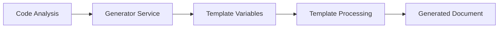

# Documentation Generator Templates

This directory contains the default templates used by the Documentation Generator VS Code extension. These templates provide the foundation for generating consistent, professional documentation from your codebase analysis.

## Template Structure

Each template is a Markdown file with YAML frontmatter that defines metadata and variables. The general structure is:

```markdown
---
name: "Template Name"
description: "Brief description of the template"
category: "documentation|planning|technical|meeting"
version: "1.0.0"
author: "Documentation Generator"
tags: ["tag1", "tag2"]
variables:
  - name: "variableName"
    type: "string|number|boolean|date|array|select"
    required: true|false
    description: "Variable description"
    default: "default value"
    options: ["option1", "option2"] # for select type
    validation:
      minLength: 1
      maxLength: 100
      pattern: "regex pattern"
---

# Template Content

Your template content goes here with {{variableName}} placeholders.
```

## Available Templates

### 1. Help Documentation Template (`help-template.md`)

**Purpose**: Generate comprehensive user documentation and help guides from codebase analysis.

**Category**: `documentation`

**Required Variables**:
- `projectName` (string): Name of the project
- `projectDescription` (string): Brief description of the project

**Optional Variables**:
- `mainFeatures` (array): List of main features with name and description
- `installationSteps` (array): Step-by-step installation instructions
- `apiEndpoints` (array): API endpoints with method, endpoint, and description
- `commonIssues` (array): Common troubleshooting issues and solutions
- `contactInfo` (string): Support contact information

**Use Cases**:
- User guides and manuals
- Getting started documentation
- API documentation
- Troubleshooting guides

### 2. Product Requirements Document Template (`prd-template.md`)

**Purpose**: Create comprehensive PRDs from project analysis and business requirements.

**Category**: `planning`

**Required Variables**:
- `productName` (string): Name of the product
- `productVision` (string): Product vision statement
- `targetAudience` (array): Target audience segments
- `businessGoals` (array): Business goals and objectives

**Optional Variables**:
- `userStories` (array): User stories with acceptance criteria
- `successMetrics` (array): Key performance indicators
- `timeline` (string): Project timeline and milestones
- `stakeholders` (array): Project stakeholders and their roles

**Use Cases**:
- Product planning documents
- Feature requirement specifications
- Stakeholder communication
- Project roadmaps

### 3. Technical Specification Template (`technical-template.md`)

**Purpose**: Generate detailed technical documentation for system architecture and implementation.

**Category**: `technical`

**Required Variables**:
- `systemName` (string): Name of the system
- `architectureType` (select): Type of architecture (microservices, monolith, serverless)
- `technologies` (array): Technology stack with categories

**Optional Variables**:
- `apiEndpoints` (array): API specification with examples
- `databaseTables` (array): Database schema documentation
- `deploymentStrategy` (string): Deployment approach and strategy
- `testingApproach` (string): Testing methodology and tools
- `securityRequirements` (array): Security considerations and requirements

**Use Cases**:
- System architecture documentation
- Technical design documents
- API specifications
- Database schema documentation

### 4. Meeting Summary Template (`meeting-template.md`)

**Purpose**: Create structured meeting summaries with action items and decisions.

**Category**: `meeting`

**Required Variables**:
- `meetingTitle` (string): Title of the meeting
- `meetingDate` (date): Date of the meeting
- `participants` (array): Meeting participants with names and roles
- `meetingType` (select): Type of meeting (planning, review, standup, retrospective)

**Optional Variables**:
- `duration` (string): Meeting duration
- `agenda` (array): Meeting agenda items
- `decisions` (array): Decisions made during the meeting
- `actionItems` (array): Action items with assignees and due dates
- `nextSteps` (array): Follow-up actions and next steps

**Use Cases**:
- Sprint planning summaries
- Meeting minutes
- Decision tracking
- Action item management

## Variable Types and Usage

### Basic Variable Types

#### String Variables
```yaml
- name: "title"
  type: "string"
  required: true
  description: "Document title"
  validation:
    minLength: 1
    maxLength: 100
```

Usage in template: `{{title}}`

#### Number Variables
```yaml
- name: "priority"
  type: "number"
  required: false
  default: 1
  description: "Priority level (1-5)"
  validation:
    min: 1
    max: 5
```

Usage in template: `{{priority}}`

#### Boolean Variables
```yaml
- name: "isPublic"
  type: "boolean"
  required: false
  default: false
  description: "Whether document is public"
```

Usage in template: `{{#if isPublic}}Public content{{/if}}`

#### Date Variables
```yaml
- name: "deadline"
  type: "date"
  required: false
  description: "Project deadline"
```

Usage in template: `{{deadline}}`

#### Select Variables
```yaml
- name: "status"
  type: "select"
  required: true
  description: "Project status"
  options: ["planning", "active", "completed", "on-hold"]
```

Usage in template: `{{status}}`

### Array Variables

#### Simple Arrays
```yaml
- name: "tags"
  type: "array"
  required: false
  description: "Document tags"
```

Template usage:
```markdown
{{#tags}}
- {{.}}
{{/tags}}
```

#### Object Arrays
```yaml
- name: "features"
  type: "array"
  required: false
  description: "Feature list with details"
```

Template usage:
```markdown
{{#features}}
### {{name}}
{{description}}

**Usage**: {{usage}}
{{/features}}
```

## Template Syntax

### Variable Substitution

#### Basic Variables
- `{{variableName}}` - Substitutes the value of a variable
- `{{analysis.propertyName}}` - Accesses properties from analysis data

#### Array Iteration
```markdown
{{#arrayName}}
Content repeated for each item
- Current item: {{.}}
- Object property: {{propertyName}}
- Index: {{@index}} (1-based)
- Zero-based index: {{@index0}}
{{/arrayName}}
```

#### Conditional Content
```markdown
{{#if condition}}
Content shown when condition is truthy
{{else}}
Content shown when condition is falsy
{{/if}}
```

#### Common Built-in Variables
- `{{currentDate}}` - Current date (locale format)
- `{{currentDateTime}}` - Current date and time
- `{{currentYear}}` - Current year
- `{{nextReviewDate}}` - Date 3 months from now

### Advanced Features

#### Nested Object Access
```markdown
{{user.profile.name}}
{{project.metadata.version}}
```

#### Analysis Data Integration
The template system automatically provides analysis data from the codebase:

```markdown
Project: {{analysis.projectName}}
Files analyzed: {{analysis.fileCount}}
Dependencies: {{analysis.dependencies}}
```

## Customization Guide

### Creating New Templates

1. **Create Template File**: Create a new `.md` file in the templates directory
2. **Add Frontmatter**: Define metadata and variables using YAML frontmatter
3. **Write Content**: Use Markdown with variable placeholders
4. **Test Template**: Use the template manager to validate and test

Example custom template:
```markdown
---
name: "Custom API Documentation"
description: "Custom template for API documentation"
category: "technical"
version: "1.0.0"
variables:
  - name: "serviceName"
    type: "string"
    required: true
    description: "Name of the API service"
  - name: "endpoints"
    type: "array"
    required: true
    description: "API endpoints"
---

# {{serviceName}} API Documentation

## Endpoints

{{#endpoints}}
### {{method}} {{path}

{{description}}

**Parameters:**
{{#parameters}}
- `{{name}}` ({{type}}): {{description}}
{{/parameters}}

**Example Response:**
```json
{{responseExample}}
```

{{/endpoints}}
```

### Modifying Existing Templates

1. **Backup Original**: Always backup the original template before modifications
2. **Maintain Structure**: Keep the YAML frontmatter structure intact
3. **Update Variables**: Add new variables to the frontmatter if needed
4. **Test Changes**: Validate the template after modifications

### Template Best Practices

#### Content Structure
- Use clear, hierarchical headings
- Include all necessary sections for the document type
- Provide meaningful default content when variables are empty

#### Variable Design
- Use descriptive variable names
- Mark appropriate variables as required
- Provide helpful descriptions for all variables
- Set sensible default values where applicable

#### Validation Rules
- Add validation constraints for string lengths
- Use regex patterns for format validation
- Provide clear error messages in descriptions

#### Documentation Standards
- Include generation timestamp
- Add template version information
- Provide clear section separators

## Variable Validation

### String Validation
```yaml
- name: "email"
  type: "string"
  required: true
  description: "Contact email address"
  validation:
    pattern: "^[a-zA-Z0-9._%+-]+@[a-zA-Z0-9.-]+\\.[a-zA-Z]{2,}$"
    minLength: 5
    maxLength: 100
```

### Array Validation
```yaml
- name: "participants"
  type: "array"
  required: true
  description: "Meeting participants"
  validation:
    minItems: 1
    maxItems: 20
```

### Number Validation
```yaml
- name: "score"
  type: "number"
  required: false
  description: "Quality score (0-100)"
  validation:
    min: 0
    max: 100
```

## Integration with Generators

### Generator Integration Points

Each generator service automatically maps analysis data to template variables:

#### HelpDocumentationGenerator
- Maps project structure to feature documentation
- Extracts installation steps from package.json
- Generates API documentation from code analysis
- Creates troubleshooting content from error patterns

#### PRDGenerator
- Converts code features to user stories
- Maps dependencies to technical requirements
- Generates acceptance criteria from function signatures
- Creates stakeholder mapping from contributor analysis

#### TechnicalSpecGenerator
- Maps file structure to system architecture
- Extracts technology stack from dependencies
- Generates API specifications from route analysis
- Creates database documentation from model files

#### MeetingSummaryGenerator
- Processes meeting transcripts for action items
- Extracts decisions from discussion content
- Maps participants to contribution analysis
- Generates follow-up tasks from conversation flow

### Data Flow



1. **Analysis Phase**: FolderAnalyzer extracts project structure and metadata
2. **Mapping Phase**: Generator maps analysis data to template variables
3. **Processing Phase**: TemplateManager substitutes variables in template
4. **Output Phase**: Final document is generated with all content sections

## Troubleshooting

### Common Issues

#### Template Not Found
- **Error**: `Template 'template-name' not found`
- **Solution**: Ensure template file exists in templates directory with correct name
- **Check**: Verify file extension is `.md` and frontmatter is valid

#### Missing Required Variables
- **Error**: `Missing required variables: variableName`
- **Solution**: Provide all required variables in the generator call
- **Check**: Review template frontmatter for required variable definitions

#### Invalid Template Format
- **Error**: `Template must have frontmatter metadata`
- **Solution**: Ensure template starts with `---` and has valid YAML frontmatter
- **Check**: Validate YAML syntax and required metadata fields

#### Variable Substitution Issues
- **Symptom**: Variables not being replaced (e.g., `{{variableName}}` appears in output)
- **Solution**: Check variable names match exactly between template and data
- **Debug**: Use template validation to check variable definitions

### Debugging Templates

#### Enable Debug Mode
```typescript
const templateManager = new TemplateManager(context);
await templateManager.initialize();

// Validate template structure
const template = templateManager.getTemplate('template-name');
const validation = templateManager.validateTemplate(template);
console.log('Validation:', validation);

// Check available variables
const variables = templateManager.getTemplateVariables('template-name');
console.log('Variables:', variables);
```

#### Test Variable Substitution
```typescript
const testVariables = {
    // Provide test values for all required variables
    projectName: 'Test Project',
    projectDescription: 'Test description'
};

const result = await templateManager.processTemplate('template-name', testVariables);
console.log('Generated content:', result);
```

### Performance Optimization

#### Template Caching
- Templates are cached after first load
- Use `templateManager.initialize()` to preload all templates
- Template validation results are cached

#### Variable Processing
- Array iterations are optimized for large datasets
- Conditional blocks are evaluated efficiently
- Analysis data is processed once per generation

#### Memory Management
- Templates are loaded on-demand if not cached
- Large variable objects are processed in chunks
- Generated content is streamed for large documents

## Extension Integration

### VS Code Commands

The templates integrate with VS Code commands for easy access:

- `docs-generator.generateHelp` - Uses help-template.md
- `docs-generator.generatePRD` - Uses prd-template.md
- `docs-generator.generateTechnical` - Uses technical-template.md
- `docs-generator.generateMeeting` - Uses meeting-template.md

### Configuration Settings

Templates can be configured through VS Code settings:

```json
{
    "docsGenerator.templates.defaultPath": "./custom-templates",
    "docsGenerator.templates.autoValidate": true,
    "docsGenerator.templates.cacheEnabled": true
}
```

### Custom Template Discovery

The extension automatically discovers templates in:
1. Extension's default templates directory
2. User's global templates directory
3. Workspace-specific templates directory
4. Custom paths specified in settings

## Future Enhancements

### Planned Features

1. **Template Marketplace**: Share and discover community templates
2. **Visual Template Editor**: GUI for creating and editing templates
3. **Template Versioning**: Support for template updates and backwards compatibility
4. **Variable Intelligence**: Auto-suggest variables based on project analysis
5. **Conditional Templates**: Dynamic template selection based on project type
6. **Multi-language Support**: Templates in different languages
7. **Template Inheritance**: Base templates with specialized variations

### Contributing Templates

We welcome contributions of new templates and improvements to existing ones:

1. Fork the repository
2. Create templates following the structure guidelines
3. Add comprehensive documentation
4. Include test cases for validation
5. Submit a pull request with examples

For template contributions, please ensure:
- Clear documentation of purpose and usage
- Comprehensive variable definitions
- Example outputs and test cases
- Proper validation rules
- Accessibility considerations

## Support and Resources

- **GitHub Issues**: Report bugs and request features
- **Documentation**: Comprehensive guides and examples
- **Community**: Discord server for discussions and support
- **Examples**: Sample projects demonstrating template usage

---

*This documentation was generated using the Documentation Generator extension. For more information, visit the [project repository](https://github.com/your-org/documentation-generator).*